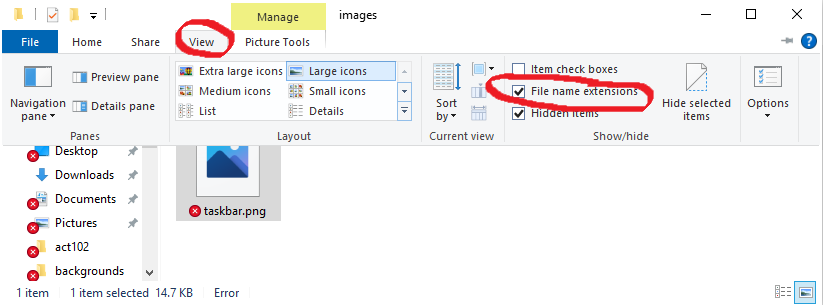

# 00.020 Windows Setup

This page has two purposes.

1) Explain file names and rules you should be aware of
2) Demonstrate how to turn on display of file extensions in Windows 10.  This should not be an issue for people using Linux or Macintosh computers.

## File Names and Extensions

Files are usually identified by a name and an extension. However, by default Windows 10 only shows the name and hides the extension.

### Picking good names for a file

Usually the user gets to pick the file name.  The name should be meaningful, but not too long.  Something like 10 to 12 characters is a good guideline for maximum length of a file name, but it is not a length imposed by Windows itself.

There are certain characters you should avoid using in file names.  These restrictions are especially important if you are in ACT 102 or most programming courses like CSC 184.

#### DO NOT PUT BLANKS IN FILE NAMES

In this course, blanks in file names are evil.  Blanks in file names cause a host of practical problems, and in this course they will sometimes prevent your web page from displaying correctly.

#### Other characters to avoid

For now, avoid most special characters in file names.  Just use letters of the alphabet, digits, and the underscrore character (_).  Other special characters in the file name may have special meaning.

#### Capitalization of file names

Windows is not "case sensitive" when it comes to file names.  That is, Windows ignores case.  A file called "Notes.txt" is the same as a file named "notes.txt" or "NOTES.TXT"

However on Linux and Mac senstes case matters.  Both Linux and Macs are "case sensitive."  So the file named "Notes.txt" is different than a file named "notes.txt"

In this course many people will be developing on their local computers which are Windows.  However, we will be storing our files on a Linux computer.  Therefore case will matter.

### IMPORTANT RECOMMENDATION

I STRONGLY SUGGEST THAT YOU USE ONLY LOWER CASE IN FILE NAMES WHENEVER POSSIBLE.  An alternative is to use "camelCase" for compound words.  Otherwise it can be hard to remember how the file was capitalized.

## File extensions

File extensions start with a period and come at the end of the file name.  Early versions of Windows had a maximum of 3 letters for the length of the extension, and most extensions are still short.

The extension describes the format of the file.  For example, files ending with .jpg or .png hold picture files, but they have different formats for storing the pictures.

### Windows 10 and file extensions

One problem with Windows 10 is that by default it does not show the file extensions.  For most users this is a good idea because making a mistake with the file extension can cause problems for the computer.  However, in most technology courses we need to manipulate the file extensions.  So we need to display the file extensions.  

To make extensions visible, open the Windows File Explorer.  It should have an icon on the task bar.

In order to make extensions visible, Click on View and then check the box labeled "File name extensions."

