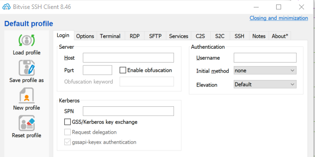
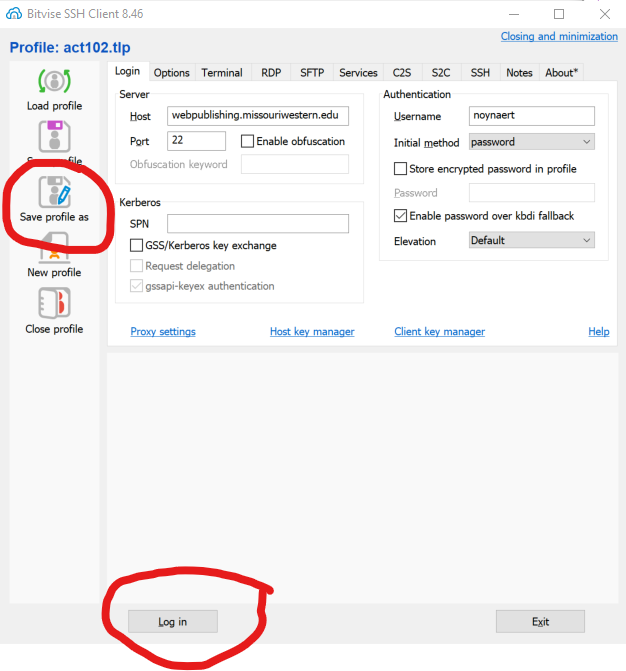

# 00.040 Bitvise for SFTP

Bitvise may be downloaded from [https://www.bitvise.com/ssh-client-download](https://www.bitvise.com/ssh-client-download)

Bitvise is a Swiss army knife type of tool for connecting with remote servers.  In ACT 102 we will be using it mostly for its "SFTP" client.  If you take CSC 274 (Linux) you will probably use Bitvise for its SSH client.

Download and install bitvise.  Then open it.  You should see an interface similar to the following:

Fill in the following fields

* Host:  webpublishing.missouriwestern.edu
* Port: 22
* Username: Use the user name assigned you use to log into goldlink.  In the following image I used "noynaert" but yours will be different
* Initial method:  For now change to "password."  I hope we can use a different method, but for now use password. 

Click on "Save profile as" on the left side of the image.  I suggest you use a meaninful name like "act102" or "webpublishing"

After saving the profile, click on "Log in" at the bottom of the application window.

After connecting you should get a message saying this is the first time connecting to this server.  Agree to the message.

Click on ............