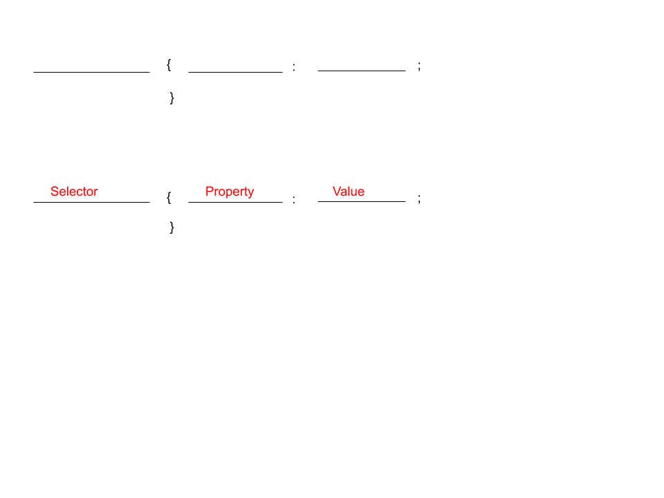

# CSS and Colors Introduction

Quickstart for this unit:

Add the following line to the head of your document:

```css
 <link rel="stylesheet" href="style.css">
```

Now, in the same folder as your html, create a file named "style.css"

## CSS

CSS stands for "Cascading Style Sheet"  CSS is used to control the appearance of a document.

The syntax of CSS is entirely different than html.

CSS consists of a series of rules that govern how different parts of a document are arranged.

### Syntax of a rule



* Selector: The selector specifies what parts of a page the rule will apply to.  A selector can be a lot of different things, but for this unit we will limit the selector to the following:
  * an html element tag such as body, h1, p, a, or hr.  Any tag will work
  * an id.  You must put # in front of the id.  For example #geography
  * A list of selectors with *commas* in between.  An example would be ```h1, h2, h3```.  The style applies to all of the elements listed.
  * Two or more selectors with a *space* in between. The style applies to the second element, but only when it is within the first element.  For example, ```#cities p``` would only apply to &lt;p&gt; tags within #cities.
* Property: There are a lot of properties. In this unit we will only cover a few. See [https://www.w3schools.com/cssref/css_selectors.asp](https://www.w3schools.com/cssref/css_selectors.asp) for a full list.
  * color:  The color to be given to the text
  * background-color: uh, the background color
  * width: The width of the item.  There are a lot of ways to measure width.  Here are a few
    * px: This stands for "pixel."  A pixel is a dot on the screen
    * em: This is approximately the size of a box drawn around a capital letter "M."  Em is a useful measurement when you want text to scale with text.
    * %:  This is the percent of the "normal" size of the element.
    * There are several others, but this will get us started.
  * Value: This varies based on the property.  The color property takes a color like red.  The width property takes a measure like 500px, 10em, or 50%.

#### Rule punctuation

Curly braces { } surround the properties in a rule.

A colon : goes between the property and the values

The semicolon ; separates rules. If there is only one rule you do not need to put the semicolon at the end, but it is a good idea to do so.

### Examples of Rules

```css
p {color: blue;} <!-- Turns all text on a page blue -->

h1, h2 {background-color: yellow;
        color: green;
        width: 50%
       }     <!-- I didn't say it was pretty -->

#geography { width: 50% }
```

## CSS placement

CSS rules may go in several places

* In a separate file.  This is what we will use for now.  The other locations may be slightly easier on small projects, but get in the habit of using a separate file
* In a &lt;style&gt; &lt;/style&gt; tag in the &lt;head&gt; &lt;/head&gt; of a document.  This location is really only suitable for websites with a single page.
* inline inside a tag (no selector is needed).  The style= attribute is used.  This location should be used only in very rare circumstances. 

## Linking the HTML file and the CSS file

If the stylesheet is called "style.css" and is in the same directory (folder) as the html file, then the following line should be placed in the &lt;head&gt; of the html document

```html
<head>
  <meta char-set="utf-8">
  <link rel="stylesheet" href="style.css">
  <title>Demo of Styles</title>
</head>

The order of the statements in the head does not matter.
