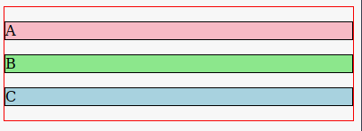
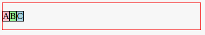

# 07_60 display:flex;

## Reference

* [https://css-tricks.com/snippets/css/a-guide-to-flexbox/](https://css-tricks.com/snippets/css/a-guide-to-flexbox/)

## Flexboxes

Flexboxes are a way to control horizontal location of objects.  They provide an alternative to "float" mechanisms.

Flexboxes must have an outer container.  Often this outer container is a ```<div>```.  When the css ```display:flex``` rule is applied to the container, all of the immediate
children of the outer container are moved into a horizontal arrangement.

It is most common for the first children to be <div> elements.  However, any block element that is the immediate child of a flexbox will be "flexed."

### Example before flex

This code is not flexed.  Note that ```.topContainer p``` refers to paragraphs in the class .topcontainer.

```html
  <style>
    .topContainer {
        border:1px solid red;      
    }
    .topContainer p {
        border:1px solid black;
       
    }
    #a {background-color: pink;}
    #b {background-color: lightgreen;}
    #c {background-color: lightblue;}
  </style>
</head>
<body>
  <div class="topContainer">
    <p id="a">A</p>
    <p id="b">B</p>
    <p id="c">C</p>
  </div>
 ```
 Results of the above:

 

### Example with just flex added

The ```display:flex``` rule was added to the .topContainer.

```css
.topContainer {
        border:1px solid red; 
        display:flex;     
    }
```
Results of the above:



### Example with some extra styling

Usually a bit of extra styling is a good idea.  ```margin:0 auto``` is good for making sure the flexed children are nicely placed.  Also, specifying the width can help.  

```css
.topContainer {
        border:1px solid red; 
        display:flex;     
        padding-top:0.5em;
        padding-bottom:0.5em;
    }
.topContainer p {
        border:1px solid black;
        width:30%;
        margin: 0 auto;    
    }
```


In this case the width was set to 30% of the container.  At 33% the boxes would almost fill the container.  I backed down to 30% to allow for some white space between the boxes

## More

Flexboxes have many more options than what we have used here.  Feel free to explore the extra options at the link at the top of the page.


