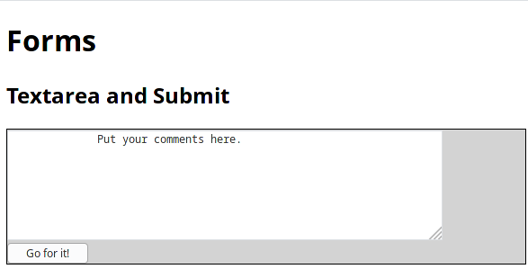
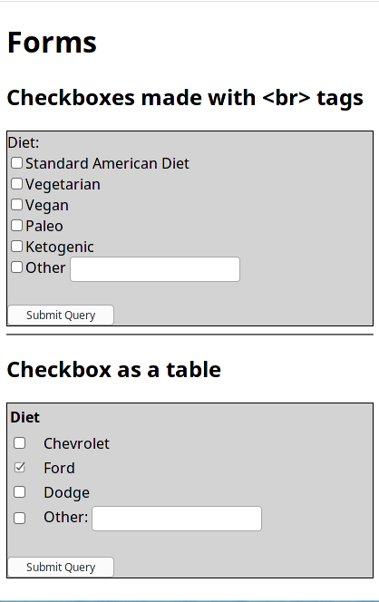

# 10a General Forms

## References

* [W3schools on forms](https://www.w3schools.com/html/html_forms.asp)
* Textbook, chapter 7

## Uses of forms

Forms allow the user to interact with a website. Users may enter data, click buttons, or use otehr controls.

The form can do different things with the user interaction:

1. Send data to another web site for processing
2. Use JavaScript on the same page to manipulate data entered by the user
3. Some combination of the above.

## Form using GET method to remote site

* ***Action*** attribute: The &lt;form> tag takes an action attribute.  The action is usually a url of a page that processes data and shows a result.  In some cases the action may be the same page.
* ***Method*** attribute: The &lt;form> tag takes a method attribute.  There are 6 possible methods, but we will only consider "GET" and "POST" methods.  

```html
<form method="GET" action="https://webservices.missouriwestern.edu/users/noynaert/act102/api/generic.php">

</form>
```

### Controls

There are several controls that may go in a form.  HTML5 introduced quite a few more, but most are just variations on the old types.

Controls go inside a &lt;form> tag, although many of the controls can appear outside a form tag for special purposes.

Most controls do not have any explanatory text.  Therefore they usually go in a &lt;p> tag with the text

### &lt;input type="text" name="age">

This is for a single line of text input.  The name is important.  It should be descriptive of the contents of the field. As usual keep it simple, meaningful, and use lower case.  Make it a single word.

There are other fields we could enter.  For example, the value attribute gives an initial set of text to the field.

Be careful using old websites about input fields.  Things like the "size" tag in the input field should no longer be used.

### &lt;input type="submit">

This is one way to submit the contents of a form.  You may give it a name, but do not have to.  You may also change the contents of the button by specifying a value.

```html
<h1>Forms</h1>
    <h2>Text input and submit button</h2>
    <form method="GET" action="https://webservices.missouriwestern.edu/users/noynaert/act102/api/generic.php">
        <p>
          <label>Age:</label>
          <input type="text" name="age" value="18"> 
        </p>
        <p>
          <label>Height:</label> <input type="text" name="feet">ft. <input type="text" name="inches">in.
        </p>
        <input type="submit">
      </form>
```


#### Text and &lt;label> tags

The &lt;input> tag does not have any type of label associated with it.  But users almost certainly need a label. Text can be just inserted within the form.  It is also possible to use div, p, table, and br tags to control layout.

In later versions of html there is a &lt;label>...&lt;/label> tag.  It is a good idea to use label tags with input fields and any other field that does not have its own text and labels built in.

#### For advanced users

[Here is a nice tutorial on animated input boxes](https://www.youtube.com/watch?v=IxRJ8vplzAo).  It is optional, and only for people that are bored or want some extra material.

### &lt;textarea name="comments"> 

Textareas are used when there are multiple lines or paragraphs of text rather than a single line.  You should specify the width and height in css.

Textareas is a paired tag.  Anything between the tags is the default content.

```html
<form method="GET" action="https://webservices.missouriwestern.edu/users/noynaert/act102/api/generic.php">
        <textArea name="age" value="18">
              Put your comments here. 
        </textArea>
    <br>
    <input type="submit" value="Go for it!">
</form>
```



### Checkboxes

Checkboxes are often grouped.  Sometimes you will create a div with a border around the div.  

Each textbox in the group has to have exactly the same name.  The value is what is sent to the action url.  The values should be lower case, descriptive and single words or camelCase.

The following code shows two text boxes.  One uses a div, the other uses a tables with no borders.

```html
<h1>Forms</h1>
    <h2>Checkboxes made with &lt;br&gt; tags</h2>
    <form method="GET" action="https://webservices.missouriwestern.edu/users/noynaert/act102/api/generic.php">
       <div>   
         <label>Diet:</label> <br>
          <input type="checkbox" name="diet" value="sad">Standard American Diet<br>
          <input type="checkbox" name="diet" value="vegetarian">Vegetarian<br>
          <input type="checkbox" name="diet" value="vegan">Vegan<br>
          <input type="checkbox" name="diet" value="paleo">Paleo<br>
          <input type="checkbox" name="diet" value="keto">Ketogenic<br>
          <input type="checkbox" name="diet" value="other">Other <input type="text" name="otherDiet">  
       </div>
       <br>
       <input type="submit">
      </form>

      <hr>
     <h2>Checkbox as a table</h2>
      <form method="GET" action="https://webservices.missouriwestern.edu/users/noynaert/act102/api/generic.php">
        <table>
            <tr><th>Diet</th><th>&nbsp;</th></tr>
            <tbody>
  
            </tbody>
            <tr><td><input type="checkbox" name="vehicle" value="chevy"></td><td>Chevrolet</td></tr>
            <tr><td><input type="checkbox" name="vehicle" value="ford" checked></td><td>Ford</td></tr>
            <tr><td><input type="checkbox" name="vehicle" value="dodge"></td><td>Dodge</td></tr>
            <tr><td><input type="checkbox" name="vehicle" value="other"></td><td>Other: <input type="text" name="otherVehicle"></td></tr>
        </table>
        <br>
         <input type="submit">
        </form>
```

