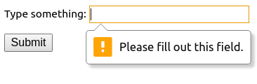

# 11b HTML5 Advanced Form Attributes

## References

* [https://www.html5rocks.com/en/tutorials/forms/html5forms/](https://www.html5rocks.com/en/tutorials/forms/html5forms/)

## ```required``` attribute

```required`` is an html attribute you may add to fields in forms.  When you submit the form it will not submit.  The browser should put an error message next to the field.  Note that required is an attribute, but it does not require a value.  The following is valid

```html
<form>
    <p class="required">Type something: <input type="text" required></p>
    <p><input type="submit"></p>
</form>
```



## ```pattern``` Attribute

The ```pattern``` attribute takes a *regular expression* as a value.

### Regular Expressions or RegEx or regex

Regular Expressions are available in most computer languages.  Regular expressions are often name "RegEx" or "regex."  But "pattern is a good description as well.

Regex can be complex and confusing.  The trick to learning regex is to start simple and add new aspects of regex as you get more experience.  

The essential idea is that you take a string of characters and see if it matches the regex or pattern.

Below I have a few of the syntax elements useful for regex in html.

* Just a string of characters can be a pattern.  For example, "G00" could specify the start of an MWSU "gnumber"
* [] surrounds a group of characters, and the regex matches if any of the characters are present.  You may also use - to indicate a range.  Examples are:
  * [Gg] would allow *either* capital or lower case G.
  * [0-9] would indicate any digit
  * [A-Za-z0-9] would allow any character (upper or lower case) or a digit
* {} indicates the number of allowed recurrances of the previous entity  If there is one number it specifies exactly that number.  If there are two digits with a comma between it indicates a range.  There are several other options that I won't go into here.
  * [0-9]{6} would require exactly 6 digits.
  * [a-z]{1,15} would require from 1 through 15 lower case letters.

A MWSU gnumber might be specified as the following.  Either would work.

```html
    <form>
        <p>Gnumber: <input type="text" pattern="[Gg]00[0-9]{6}"></p>
        <!--Another way to do it.-->
        <p>Gnumber: <input type="text" pattern="G00[0-9]{6}" title="A G Number must start with G00 followed by exactly 6 digits."></p>
        <p><input type="submit"></p>
    </form>
```

The default text message is not terribly helpful  You may specify a title attribute that will add your message to the preferred message

```html
    <form>
        <p>Gnumber: <input type="text" pattern="G00[0-9]{6}" title="A G Number must start with G00 followed by exactly 6 digits."></p>
        <p><input type="submit"></p>
    </form>
```


One problem with these messages is that different browsers display the message differently.

